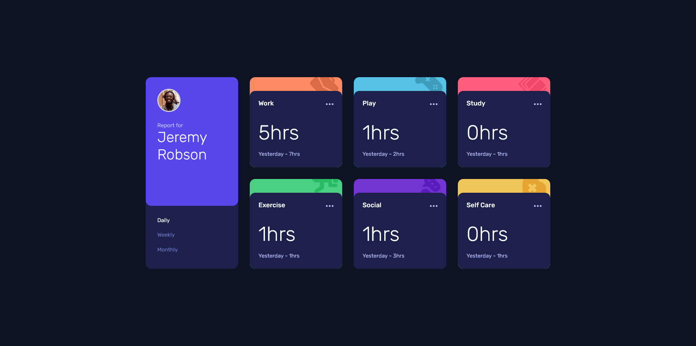

# Frontend Mentor - Time tracking dashboard solution

This is a solution to the [Time tracking dashboard challenge on Frontend Mentor](https://www.frontendmentor.io/challenges/time-tracking-dashboard-UIQ7167Jw). Frontend Mentor challenges help you improve your coding skills by building realistic projects. 

## Table of contents

- [Overview](#overview)
  - [The challenge](#the-challenge)
  - [Screenshot](#screenshot)
  - [Links](#links)
  - [Built with](#built-with)
  - [What I learned](#what-i-learned)
  - [Continued development](#continued-development)
- [Author](#author)

## Overview

By building this project, I was able to practice fetching data from an external source and displaying them in the page. I have implement some JavaScript logic for requesting the data from a source and then handling the response returned. After receiving the expected data, I then create the logic to update the elements and display the data effectively.

### The challenge

Users should be able to:

- View the optimal layout for the site depending on their device's screen size
- See hover states for all interactive elements on the page
- Switch between viewing Daily, Weekly, and Monthly stats

### Screenshot



### Links

- Solution URL: [https://www.frontendmentor.io/solutions/responsive-time-tracking-dashboard-with-data-fetching-QHJnXb8y4R](https://www.frontendmentor.io/solutions/responsive-time-tracking-dashboard-with-data-fetching-QHJnXb8y4R)
- Live Site URL: [https://schindlerdumagat.github.io/time-tracking-dashboard/](https://schindlerdumagat.github.io/time-tracking-dashboard/)

### Built with

- Semantic HTML5 markup
- Flexbox
- CSS Grid
- JavaScript (Asynchronous, Data Fetching)
- Mobile-first workflow
- [Sass](https://sass-lang.com/) - CSS Preprocessor
- [BEM](https://getbem.com/) - Block Element Modifier

### What I learned

By building this project, I was able to learn how to fetch data from an external source and display them in the page. I learned how to handle asynchronous task like data fetching using JavaScript promises and implement error handling as well.

```js
async function fetchData() {
    const response = await fetch("data.json");
    
    if(!response.ok) {
        throw new Error("Failed to fetch data");
    }
    const data = await response.json();
    return data;
}

fetchData()
.then(data => {
    reportData = data;
    initializeReport(data)
})
.catch(err => console.error(err));
```

### Continued development

For future projects, I plan to learn more on fetching and working with data including some of the best practices when it comes to handling data and displaying it to the page. I also plan to learn how to handle errors when fetching data and display a fallback UI to the page that indicates that fetching the necessary data for the page has failed.

## Author

- Website - [Schindler Dumagat](https://schindlerdumagat.github.io/webportfolio/)
- Frontend Mentor - [@schindlerdumagat](https://www.frontendmentor.io/profile/schindlerdumagat)
- LinkedIn - [@schindlerlinkedIn](https://www.linkedin.com/in/schindler-dumagat-015238230/)
